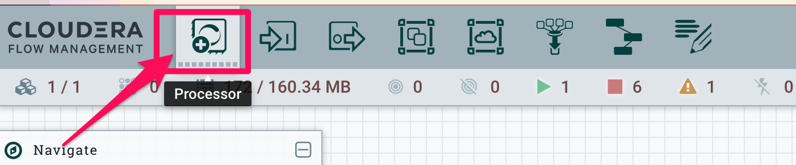
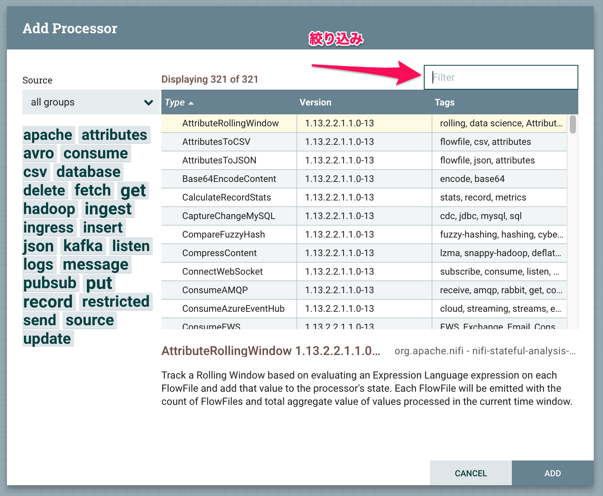
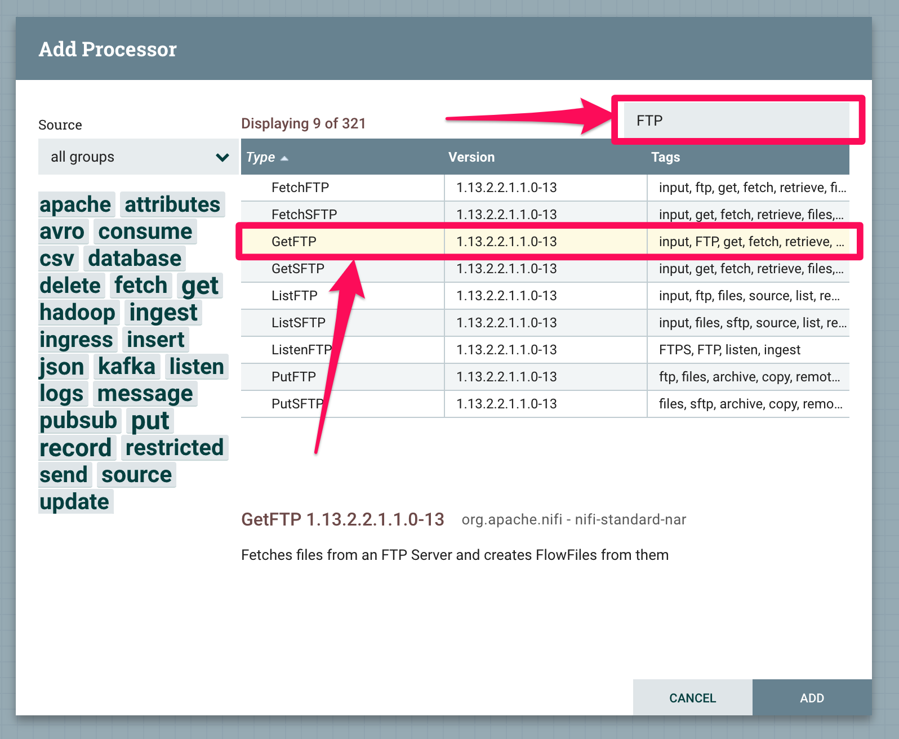
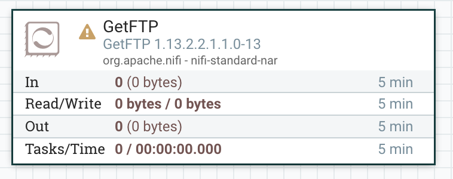
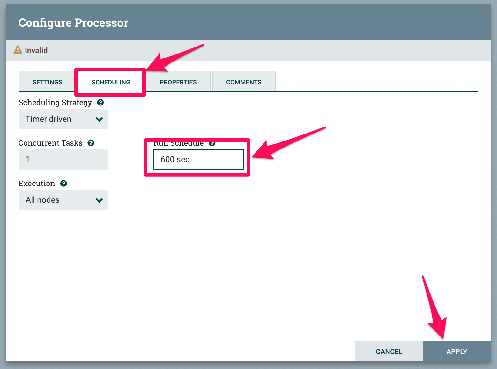
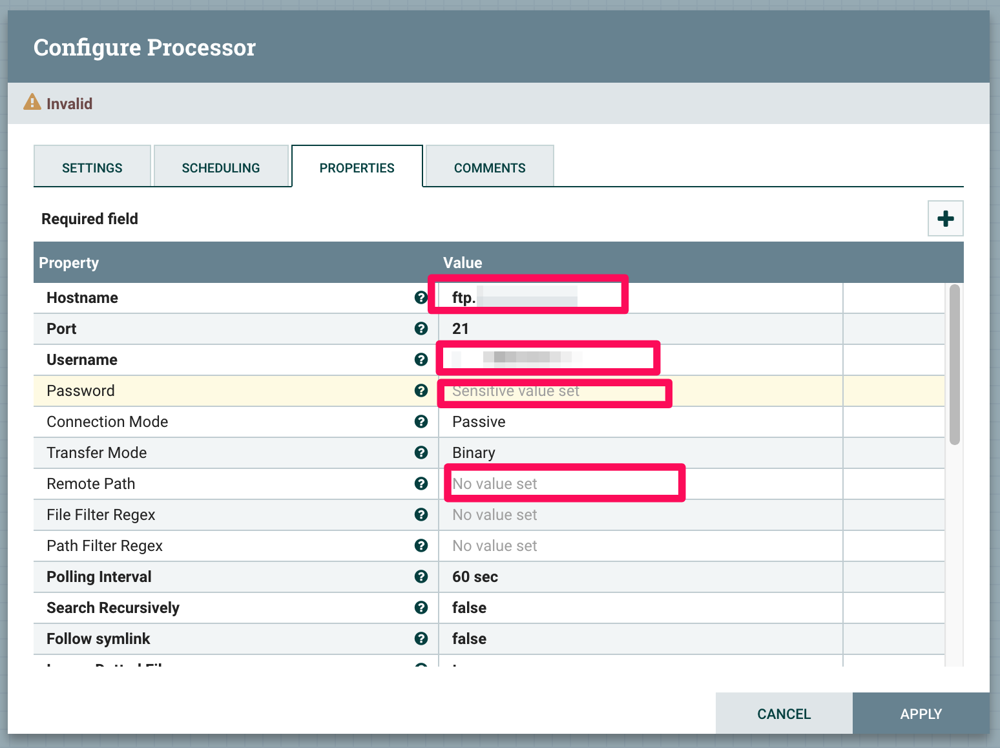

# Cloudera CDP / CDF Workshop
Cloudera CDP Workshop

## Hands on概要：
1) NiFi でテストデータを集めて、HDFSにデータを保存

2) データETL変換

3) HDFSに保存したデータをHUE+Hiveで分析

4) HDFSに保存したデータをCML+Sparkで分析

## 本日のサーバー、アカウント情報
自分のアカウント・サーバーを取得。

サーバーアドレス一覧：

皆さんが自分利用しているサーバーに、名前を入力してください。
それぞれAWSで実行している違うVM機です。

## 1) データ収集
### 1.1) FTPサーバーから、データを収集
FTPからデータを取得し、HDFSの指定したフォルダに保存

#### step 1: FTPのフォルダから差分ファイルを取得

FTP取得頻度を0秒から600秒に変更：

GetFTPの各プロセッサー設定値：

|===
|キー | 値

|Hostname
|Google Docs参照

|Username
|Google Docs参照

|Password
|Google Docs参照

|Remote Path
|Google Docs参照

|===

### 1.2) AWS S3ストレージから、データを収集
AWS S3からデータを取得し、HDFSの指定したフォルダに保存

AWS Access Key、Secret Access KeyはGoogle Docs参照

## 2) データETL変換

## 3) HDFSに保存したデータをHUE+Hiveで分析

## 4) HDFSに保存したデータをCML+Sparkで分析
